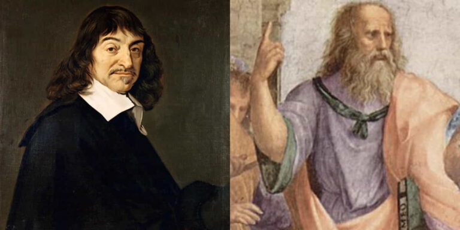
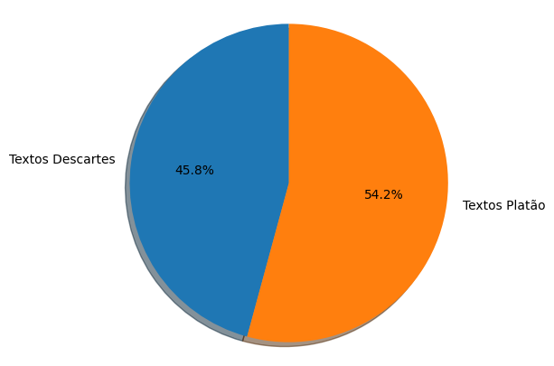
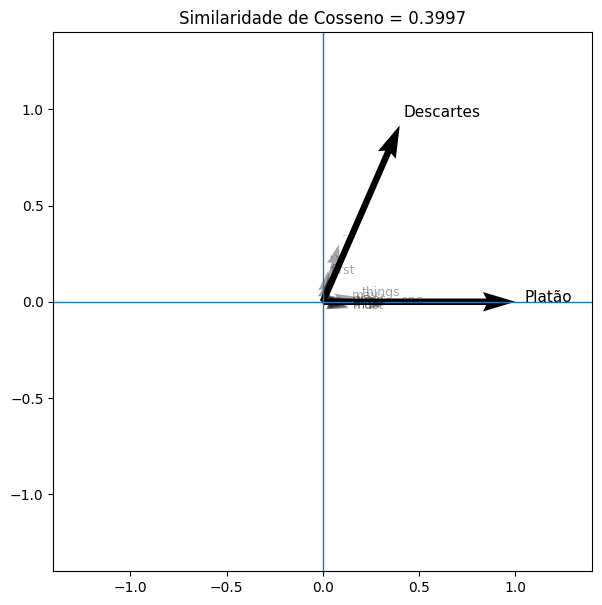
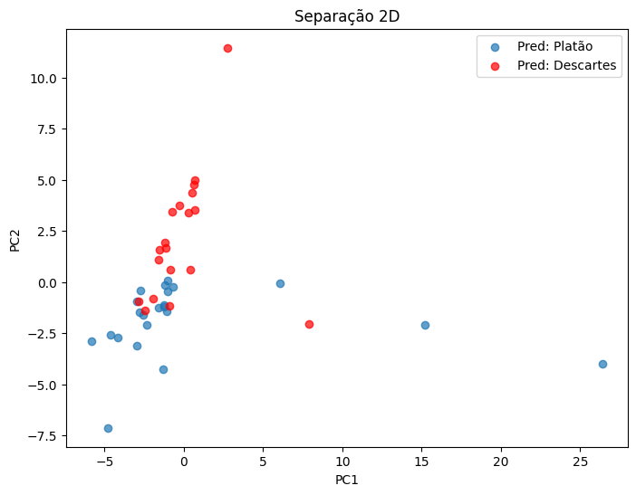
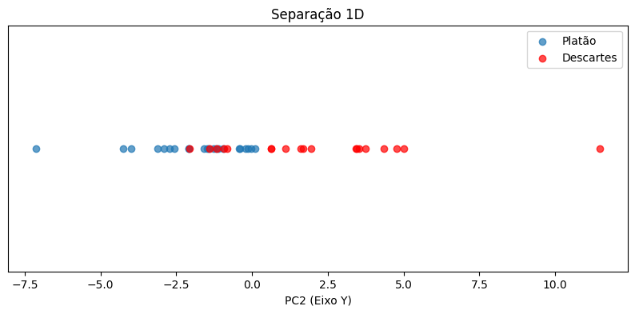

# Classificação de Autoria: Platão vs Descartes com Word Embeddings e MLP

Este projeto apresenta a implementação completa de um pipeline de
Classificação de Autoria Textual, distinguindo frases de
**Platão** e **René Descartes** utilizando **Word Embeddings**, **PCA**
e uma **Rede Neural MLP Simples**.

Todo o processo foi desenvolvido do zero, incluindo:

-   Coleta automática de citações pelo Wikiquote API
-   Pré-processamento textual
-   Transformação em embeddings
-   Redução de dimensionalidade com PCA
-   Augmentação de Dados
-   Treinamento de MLP com regularização L2
-   Visualização da separação em 2D e 1D

O objetivo é classificar cada frase como:

-   0 → Platão\
-   1 → Descartes

------------------------------------------------------------------------

## Instalação

Clone o repositório:

git clone
https://github.com/TarikSalles/descartes-vs-plato-classification

Instale as dependências:

pip install -r requirements.txt

------------------------------------------------------------------------

## Dataset

As frases foram coletadas automaticamente via **Wikiquote API**,
utilizando requisições HTTP para obter citações de:

-   Platão\
-   René Descartes

O dataset é gerado dinamicamente no notebook.

------------------------------------------------------------------------

## Pré-processamento

### Tokenização

Separação do texto em palavras utilizando `word_tokenize`.

### Lowercase

Conversão para minúsculas para evitar diferenciação artificial de
tokens.

### Remoção de Stopwords

Remoção de palavras de baixo valor semântico.

### Remoção de Pontuação

Eliminação de caracteres especiais para reduzir ruído.

------------------------------------------------------------------------

## Representação com Word Embeddings

Cada palavra é transformada em um vetor de **100 dimensões** utilizando
embeddings pré-treinados (GloVe via `gensim`).

Cada frase é representada pela média dos embeddings das palavras:

v_frase = (1/n) \* Σ v_palavra_i

Essa abordagem cria um único vetor fixo por frase.

------------------------------------------------------------------------

## Data Augmentation

Aplicada apenas no conjunto de treino:

-   Remoção aleatória de palavras\
-   Adição de ruído gaussiano leve nos embeddings

------------------------------------------------------------------------

## Redução de Dimensionalidade (PCA)

Após gerar embeddings de 100 dimensões por frase, é aplicado **PCA** para
reduzir para 64 dimensões.

O PCA é ajustado apenas no treino para evitar data leakage.

------------------------------------------------------------------------

## Modelo MLP

Arquitetura utilizada:

Dense(128, activation='relu', kernel_regularizer=L2) Dropout(0.4)
Dense(64, activation='relu', kernel_regularizer=L2) Dropout(0.3)
Dense(1, activation='sigmoid')

Função de perda: Binary Crossentropy

------------------------------------------------------------------------

## Resultados

No conjunto de teste:

-   Accuracy ≈ 85%
-   Loss ≈ 0.44

------------------------------------------------------------------------

## Visualização

Foram geradas visualizações nas predições dos dados de teste:

-   PCA 2D
-   Projeção 1D no eixo mais discriminativo (eixo y)

As duas separações, especialmente a unidimensional, mostram que o modelo aprendeu a distinguir de forma satisfatória os dois padrões textuais nos textos dos filósofos

------------------------------------------------------------------------

## Tecnologias Utilizadas

-   Python
-   NumPy
-   NLTK
-   Gensim
-   Scikit-learn
-   TensorFlow / Keras
-   Matplotlib
-   Jupyter Notebook
